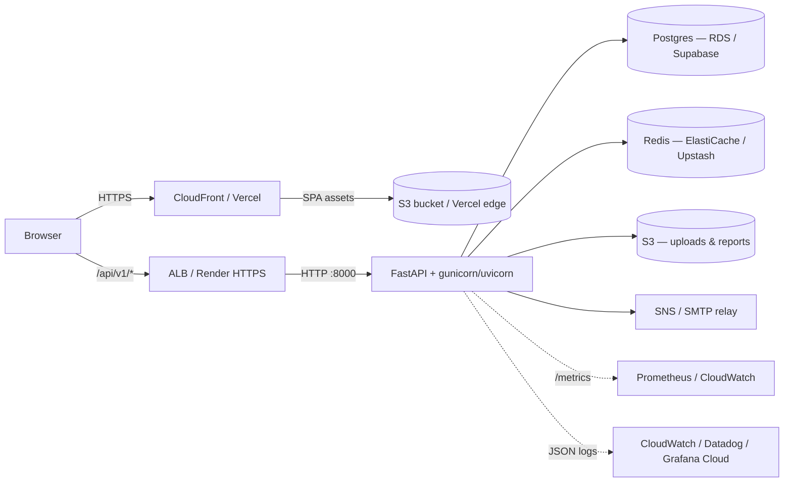

# PetroLedger — Architecture

## Request lifecycle

1. Browser loads SPA from CDN (CloudFront or Vercel).
2. API calls hit `/api/v1/*` on the load balancer.
3. Global middleware chain (outer → inner):
   - CORS
   - RequestLogging (structlog)
   - SlowAPI rate limit
   - SecurityHeaders
   - Tenant-lock (423 if tenant flagged `is_locked`; SUPERADMIN/PROVIDER bypass)
4. Route dependencies:
   - `get_current_user` — decodes JWT, rejects blacklisted tokens,
     verifies tenant-id claim matches DB.
   - `require_role(...)` — RBAC gate on protected routes.
   - `tenant_scope` — auto-filters every query by tenant.
5. Response emitted with security headers baked in.

## Data model (high-level)

- `tenants` ─┬─ `organizations` ─┬─ `pumps` ─┬─ `nozzles`
            │                    │          └─ `workers`
            │                    └─ `shifts` ─┬─ `nozzle_assignments`
            │                                 ├─ `meter_readings`
            │                                 ├─ `cash_entries`
            │                                 └─ `reconciliation_results`
            └─ `users` (role: owner/admin/manager/worker + platform roles)

## Portability

The backend is a single stateless container; the frontend is static
assets. Both run unchanged on Render, ECS Fargate, EKS, App Runner, Fly,
Railway, or a plain VM + nginx. The Terraform skeleton under
`infrastructure/terraform` encodes the recommended AWS topology.
